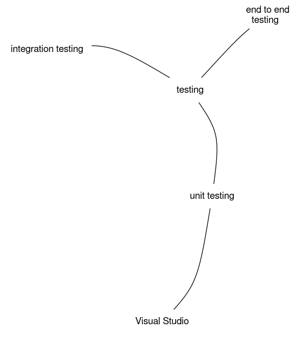
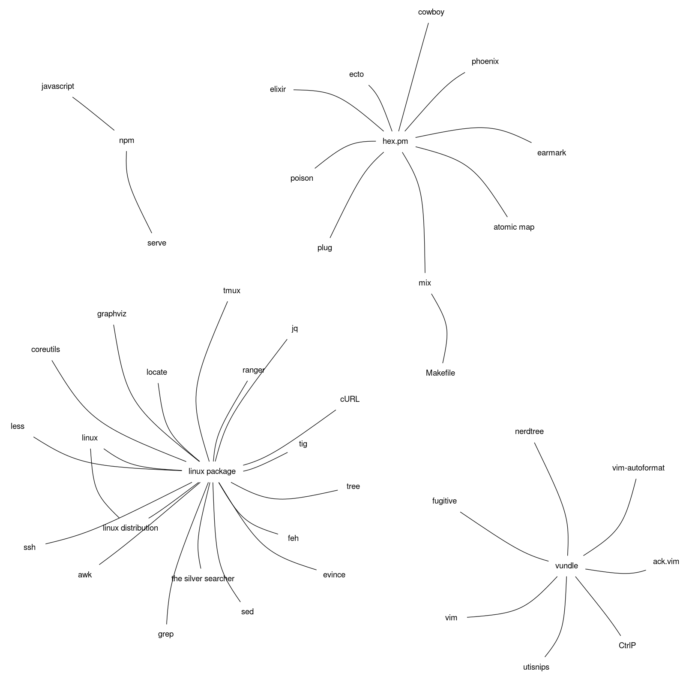
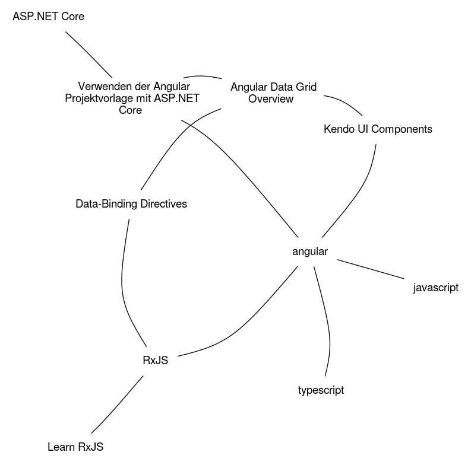
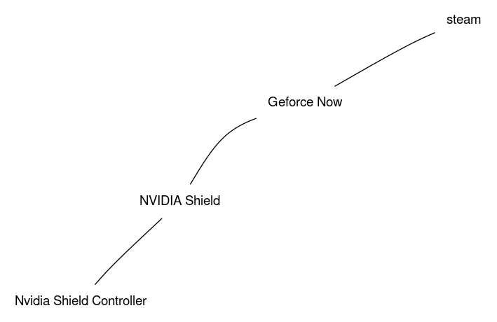

# Memories

This project contains `memories` for the [brain project][brain]
The content licenced with CC BY-SA 4.0

The [create_examples.sh](create_examples.sh) script can populate the examples folder.

## examples

    brain --search elixir | fdp -Tpng > examples/elixir.png

    brain --search vim | fdp -Tpng > examples/vim.png

    brain --search ranger | fdp -Tpng > examples/ranger.png

    brain --search testing | fdp -Tpng > examples/testing.png

    brain --search sql | fdp -Tpng > examples/sql.png
  

    brain --search docker | fdp -Tpng > examples/docker.png

    brain --search linux | fdp -Tpng > examples/linux.png

    brain --search package | fdp -Tpng > examples/package.png

    brain --search java | fdp -Tpng > examples/java.png

    brain --search angular | fdp -Tpng > examples/angular.png

    brain --search nvidia | fdp -Tpng > examples/nvidia.png

    brain --search glass | fdp -Tpng > examples/glass.png

    brain --search reload | fdp -Tpng > examples/reload.png

    brain --all | fdp -Tpng > examples/all.png

## Contact

Jan Frederik Hake, <jan_hake@gmx.de>. [@enter_haken](https://twitter.com/enter_haken) on Twitter.

[brain]: https://github.com/enter-haken/brain
